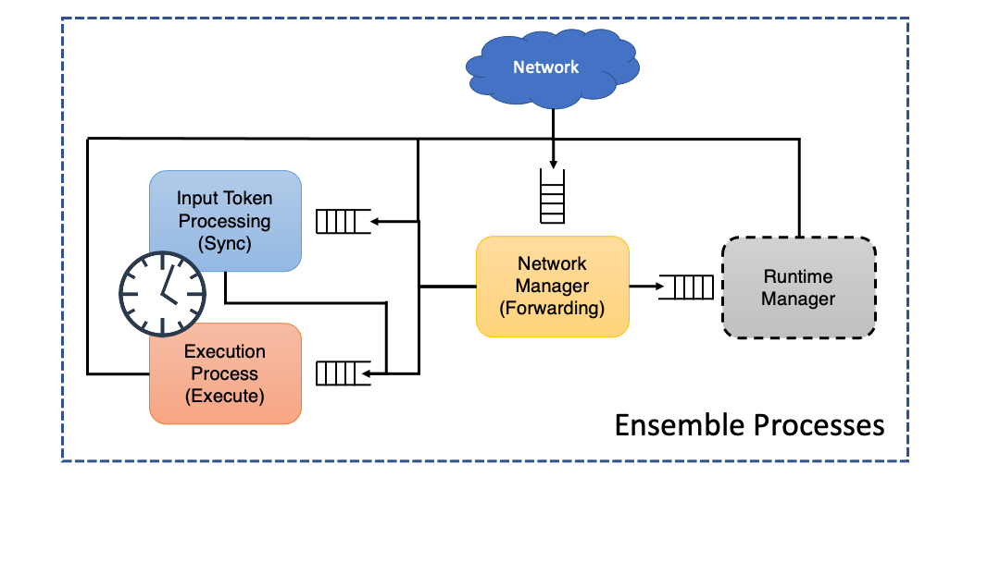

Ensemble Architecture
======================

.. _ensemble:

We refer to devices as "Ensembles" in the parlance of TickTalk due to the large
amount of heteogeniety in the hardware elements accessible to each device. Here,
we describe the internal software architecture of an Ensemble at runtime, which
is designed to support many SQs on devices with potentially multiple CPU cores
by running multiple processes with well-defined and consistent interfaces.

The image below shows these processes on an ensemble. Note that a 'Runtime
Manager' Process would only run on the Ensemble that has been designated as the
runtime manager; it does not exist on most Ensembles in practice.

These processes' exact definitions can be found in
:ref:`TTInputTokenProcess<syncprocess>`,
:ref:`TTExecuteProcess<executeprocess>`,
:ref:`TTNetworkManager<networkprocess>`, and
:ref:`TTRuntimeManagerProcess<runtimeprocess>`.

We follow a common paradigm here: Each process receives all its input through a
singular thread/process-safe queue, and each message is self-describing such
that the process knows exactly how to interpret the message payload when it
arrives (gracefully ignoring those it does not recognize). These processes do
not directly share any memory, although the ``InputTokenProcess`` and
``ExecuteProcess`` both use the same syscalls to access the synchronized clock
(of which the ``TTClocks`` derive their current timestamps from). This is an
architectural decision meant to provide consistency and easily extensible
interfaces. However, this abstraction does carry nontrivial overhead,
particularly in terms of how long it takes to send data between processes
(copying virtual memory, serializing objects, context-switching at the OS
level). Implementing these processes as threads reduces context-switching and
memory-sharing overhead, but prevents efficient use of multi-core processors
since Python3 is otherwise single-threaded.

SQ Synchronization and Timing Control
-------------------------------------

The ``InputTokenProcess`` handles the more novel aspects of our timed dataflow
model, in that it holds input ``TTTokens`` in intermediate storage (also called
a *waiting-matching* section) while it checks the
:ref:`TTFiringRule<firing-rule>`. In timed dataflow, this includes looking a
time intervals for overlaps that suggest concurrency in the sampled data.

This portion of the Ensemble also handles the majority of timing control
mechanisms, such as when to sample for a stream again or when a deadline should
expire. Usually, this entails creating an ``Message`` that will release a token
some time in the future.

As inputs are synchronized such that the firing rule is satisfied, those tokens
are generally evicted from the waiting-matching section. However, since we use a
fuzzy and fungible mechanism for passing this synchronization barrier, we ask
ourselves, "what happens with the tokens that fall through the cracks?" In
Dataflow literature, this was avoided entirely by self-cleaning graphs, which
operated by more idealized synchronization. We have no such privilege here. This
issue is no different from a classic problem with dynamic memory -- garbage
collection. Our existing solution to this problem is to once again leverage
time. In a stream-processing context, the older a token is, the less likely it
is to be consumed and eventually, it is *stale* enough to garbage collect. In
practice, we check against some staleness criteria whenever a firing rule passes
to evict tokens that are too old to use.

SQ Function Execution
----------------------

The ``TTExecuteProcess`` handles SQ execution and SQ execution only. As SQs
arrive and are instantiated, this process creates a unique namespace for each SQ
and pre-executes (Python ``exec``) the SQ so that the actual function within the
SQ is prepared for execution (this helps each SQ run slightly faster, especially
for the first invocation).

When executing, this process grabs values from the tokens and provides them to
the programmer-defined function. In some instances, the programmer may specify
they need access to the full tokens (using an optional keyword argument
``TTExecuteOnFullToken=True`` in the function definition; see
:ref:`Instructions<instructions>` for an example). In this scenario, they can
manipulate time intervals and values however they like, but are *not* free to
manipulate clocks given the potential side effects for other SQs.

Some SQs require a new time-interval to be generated, such as the output of a
stream-generating (*i.e.*, ``STREAMify`` -ed) SQ. For these, the timestamp of
sampling is approximated as the midpoint between when execution started and
finished. The time-interval is then set to be that timestamp plus-minus some
*data-validity interval*, which the programmer should have specified according
to their needs (defaults to the period). Otherwise, the output tokens carry the
same time-interval as the intersection of the input tokens' intervals.

SQ Execution is also where any physical IO will occur. The programmer's
``SQify'd`` code will do this. If this requires libraries to interact with
lower-level mechanisms implemented within the ensemble, those libraries *must*
be imported within user's defined function (putting imports at the top of the
file that ``SQify`` -s is *not* sufficient.)

.. comment: An interesting choice would be to spawn a thread for each running
  SQ, mainly to handle IO lock. The saying goes to use processes when you are
  processor/memory locked, and threads when IO locked (the latter has much lower
  overhead and allows concurrently accessible virtual memory). A programmer is
  free to include delays and polling within their own SQ. Often, this is a poor
  practice and misses the point of TickTalk and SQs, but some hardware will
  nonetheless take time to receive data over an interface, such as UART (imagine
  SDI-12, a half-duplex bus running at the speed of molasses: 1200 baud. That's
  a long time to stall the execution of *all* SQs). Alternatively, Python swaps
  threads based on execution time or instruction counts -- maybe a poor decision
  due to overhead if we have a couple of compute-heavy SQs running in parallel
  rather than sequentially. This is not entirely unique to Python 3 runtime, but
  that environment does impose harder restricts than some runtimes might. NB:
  the simulation environment may not be friendly to delays within SQs due to the
  interruption mechanics used at each process's interface (when a new value is
  inserted, the process interrupts, which acts as an exception. If possible, an
  easy fix would be effecitvely 'turn off interrupts' as is ordinarily done in
  'critical' sections)

SQ Output Forwarding and Network Management
-------------------------------------------

The ``TTNetworkManager`` plays a central role in that it implements the
``TTNetworkInterface``, such that any messages that arrive to the Ensemble come
to this process before being unpacked and sent to the correct process. This also
handles the Forwarding section of SQs.

In managing the ``TTNetwork``, this process is also responsible for maintaining
a routing table that helps associate ensemble names with the location to send
``TTNetworkMessages`` to. This routing table is generally constructed while
Ensembles are joining the network with the help of the Runtime Manager. The
format of these addresses depends on the specific ``TTNetworkInterface``
implementation, but each Ensemble should be able to send messages to another
Ensemble without fear of an inaccessible address (Note that we take a
decentralized approach at runtime. A less efficient but more robust strategy
might be to use pub-sub like MQTT). Ensembles send ``TTNetworkMessages`` to each
other by dereferencing a TTEnsemble's name into an address that it can use to
send the bytes of that message through the network interface that it implements.

Each ``TTNetworkMessage`` contains one or more ``Messages``, which have clearly
defined information to delineate who (among the set of local processes) and how
the individual components of the Network Message should be handled.

The Runtime Manager
-------------------------------

The Runtime Manager is a priveleged ensemble within the TickTalk Runtime
Environment. For the time being, there is one of these per Runtime Environment.
The Runtime Manager, as the name suggests, only handles operations within the
'management' plane at run time; it plays a minimal role during graph
interpretation.

In essence, the Runtime Manager helps setup and teardown the system before and
after graph interpretation. A Runtime Manager is any ensemble that implements
the ``TTRuntimeManagerProcess``. Its responsibilities include accepting new
``TTEnsembles``, keeping track of all ``TTEnsembles`` that have connected thus
far, propagating or updating routing information to help ensembles find each
other in the network (typically using a reachable IP and port), mapping SQ,
instantiating SQs, sending ``TTClock`` specifications to ensembles, injecting
initial tokens into the graph along input arcs (to initiate graph
interpretation), and logging of output tokens. The ``TTRuntimeManagerProcess``
only interacts with the ``TTNetworkManager``

More details on the Runtime Manager and system-wide procedures are described in
the :ref:`TickTalk Runtime Environment<runtime-env>` page.
