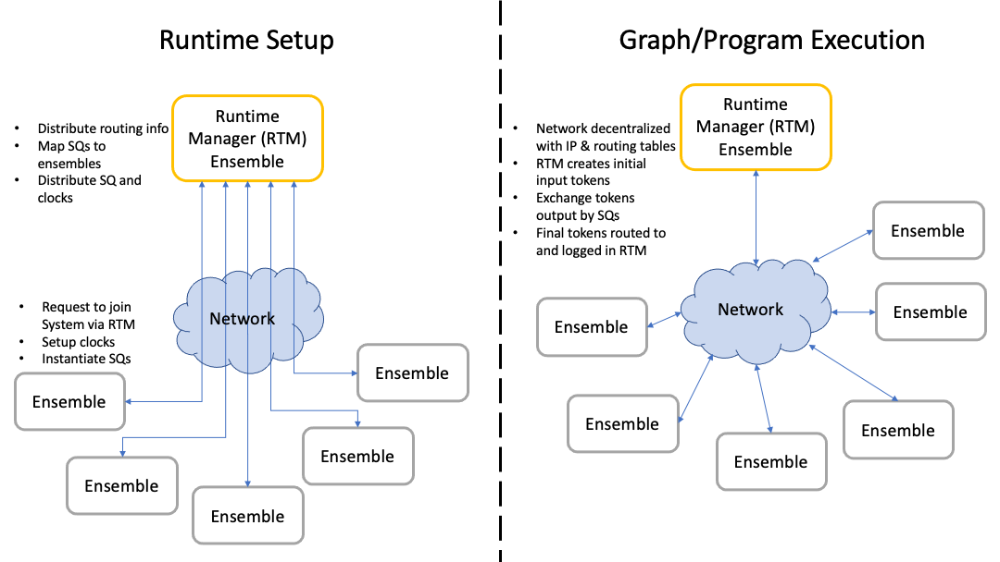

TickTalk Runtime Environment
=============================

.. _runtime-env:

This page describes the overall runtime environment of all collaborating
ensembes that engage in TTPython graph interpretation/execution and the
procedure involved in creating, configuring, and using this runtime environment.
The following image shows this as two stages: setting up the system/network and
interpreting/executing the compiled graph on that network of Ensembles.

The :ref:`Runtime Manager<runtimeprocess>` plays a central role in this setup,
but largely fades into the background once graph execution begins. However, an
expansion to mapping features would likely give this Ensemble a more active role
as dynamic mapping at runtime (including SQ migration) would vastly increase the
complexity of this mechanism.

Runtime Setup
--------------

To setup the runtime environment, the Runtime Manager acts as a known and
trusted coordinator. Each of the Ensembles in the system is expected to know the
name and address of the Ensemble acting as the Runtime Manager (which is
typically named 'runtime-manager' for simplicity).

To join the network, each Ensemble will request to join by sending a message to
the runtime-manager that includes the requester's Ensemble name, a reachable
address over the network (this should be reachable by all Ensembles that will
connect!), and some self-identifying information about the Ensemble's
constraints and capabilities. The Runtime Manager, upon accepting the new
Ensemble, will add this device to network by storing its self-description and
adding it to a routing table. At this point, the Runtime Manager will also
notify all Ensembles that were already connected about the new one, providing
its name and address at a minimum. Depending on the size of the network, this
can take some time. It is recommended that a user monitor the Runtime Manager
during this stage. It is assumed that network connectivity or addresses will not
change throughout runtime.

Once all Ensembles that will participate have joined, the Runtime Manager will
decide how to map the SQs to Ensembles and generate the SQ-Forwarding
information accordingly. The Ensemble then distributes clock specifications to
each Ensemble. The Runtime Manager then distributes messages containing a
specification for the SQs to run, including sync, execute, and forwarding
portions, to those Ensembles that will host and run the corresponding SQs. As
the Ensembles receive these SQs, they will instantiate the SQs by configuring
temporary storage, compiling the execution portions of SQs, registering
references to clocks with SQs, etc. When all SQs have arrived and been
instantiated, the graph is ready to be executed.

Graph/Program Execution
-----------------------

During graph execution, the only job of the Runtime Manager is to send initial
input and log final output tokens. Otherwise, all runtime operations are
entirely distributed among the Ensembles.

The Runtime Manager will be provided a set of values for the initial input
tokens (one value per input arc), and will kick off execution by distributing
those initial values to all SQs that are triggered by inputs to the graph (for
example, all constant-value generating nodes will receive the token
corresponding to the first arc). By default, these inital tokens contain
infinitely large timestamps to make synchronization trivial, and they are not
generated or streamed continuously (alterations to time tokens and generation of
streams is part of the programmer-written TTPython graph resulting from
compilation).

At this point, the graph will execute in parallel as much as possible across the
set of Ensembles and SQs. SQs will synchronize inputs, execute their internal
functions, produce outputs, and send them (directly addressed) to their
consumer(s), continuing until there are no tokens left to synchronize or
generate.

Every graph will have a set of SQs that produce arcs with no consumer. These
'output arcs' final indications of how the program progressed, and are
automatically sent back to the Runtime Manager, which will log their timestamp,
value, source SQ and source Ensemble (name) in an output log file.

Template Scripts for the Runtime
-------------------------------------

For convenience, two starter files are provided to help create the runtime
system and display outputs. Within the 'tests' folder of the repository,
``multi-dev-rtm.py`` and ``multi-dev-client.py`` will create a Runtime Manager
Ensemble and a client Ensemble, respectively. Each requires the first two
command line arguments to the IP and port the Ensemble will *receive* data on.
``multi-dev-client.py`` also expects two more CLI arguments for the port and IP
of the Runtime Manager. The name of each client Ensemble is randomly generated,
and the name of the Runtime Manager is assumed as default.

The Runtime Manager Ensemble contains a few 'wait-for-input' calls to let the
client Ensembles connect and process messages betweeen the stages of Runtime
Setup and Graph Execution (the alternative is a race condition). All the user
should do to move to the next stage is to hit return/enter. Once activated, the
client Ensembles will remain in their 'steady state' where they listen for
messages over the network until 90 seconds after the first input check. The
Runtime Manager Ensemble will stay in this state for 60 seconds. These
parameters were chosen only for ease of testing. When the timeout is reached,
all TTPython processes running on the Ensemble will be killed. The Runtime
Manager Ensemble will also parse the output token log in the calling directory)
and plot token values for each source SQ
(the x-axis will be time, represented as the midpoint of the ``TTTime``
interval).

These have been tested thus far on OSX (acting as the Runtime Manager), a
Raspberry Pi, and a VM running Ubuntu on a server.