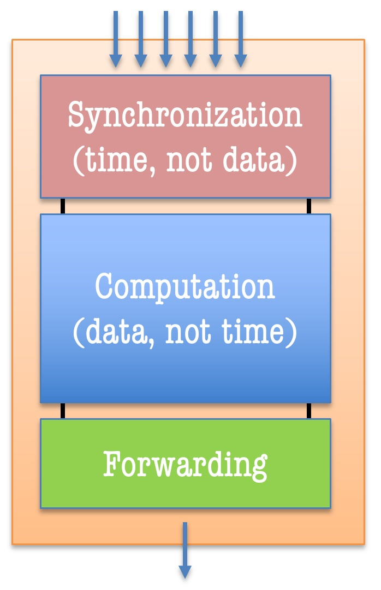

Scheduling Quantum (SQ)
========================

.. _sq:

In TTPython, the fundamental unit of computation is the graph node.  We borrow a
concept of the ``SQ`` as the embodiment of a graph node, and we further adopt
the firing rules of the MIT Tagged-Token Dataflow Architecture (TTDA) -- but
with modifications to handle time-sensitive operations.  ``SQs`` capture the
core notions of synchronization and computation and support the concept of
arbitrarily mapping units of computation onto actual computing devices.  Let's
consider the structure of a single TTPython ``SQ``.

In the above image, the ``SQ`` is shown as being made up of three parts, which
we will describe the :ref:`semantics<sqsemantics>` of after covering a
fundamental difference between our SQs and the historical ones, a difference
that makes ours more practical in time-sensitive applications.

Time as the New Tag
-------------------

Like the MIT TTDA, we imagine waves of separately-colored tokens flowing through
program graphs.  But the IoT is a different kind of computing system, typically
a cyber-physical one in which sensors of various sorts are sampling physical
quatities, creating streams of values that are similar to, but not the same as,
streams of values in the MIT TTDA. In the IoT, the colors (*i.e.*, the context
tags) would be more properly derived from the **time at which the sampling was
done**.  With mutiple, independent sensors concurrently sampling the state of an
intersection (e.g., cameras producing streams of images periodically), we would
like to arrange for samples taken by different sensors at the same time to have
the same tag and, in like manner, to make sure that samples taken at different
times end up with different tags.  If we have this property, then we can imagine
writing a graph program and using a time-based token-matching rule to fuse
like-timed sensor values by matching them based on a notion of concurrency.  As
such, an important part of our research is developing the time-stamping
mechanisms for such sampled values and being able to prove that time-tags have
similar properties as TTDA tags (and of equal importance, where these time-tags
are fundamentally different).

One important complication is the inability to realize a global clock in a
large, distributed IoT system.  Just as dataflow eschews reference to global
values, so the IoT (or any distributed system) eschews the notion of referring
to a single global clock.  Network-based techniques for doing so are limited by
the temporal behavior of the network itself (it is hard to read microsecond
times using a network that has millisecond-level transit times and transit time
asymmetries). As such, real IoT systems must proceed with the notion that times
used by IoT programs will necessarily be imprecise.

Time Tags in TTPython
^^^^^^^^^^^^^^^^^^^^^^^

Proper execution, or interpretation, of TTPython graphs is done with tokens
bearing time-based tags.  We make three basic assertions for timed-token
processing:

* The firing rule for every regular SQ in the system is based on finding a set of tokens (one per input arc) that are *all* derived from the same clock and for which the times in the tags have a non-empty overlap.
* The output token(s) will be based on the same clock as the input tokens, and the time interval of the output will be the intersection of the time intervals of the inputs.

SQ Semantics
-------------

.. _sqsemantics:

The SQ's three components, Sync, Execute, and Forward, each of their own
semantics and are designed to independently perform their assigned procedures
are runtime, communicating only via :ref:`Inter-Process Communication
Messages<ipc>`. and without direct memory sharing.

SQ Synchronization
^^^^^^^^^^^^^^^^^^^

Find more specific details about APIs and implementation are in
:ref:`TTSQSync<sqsync>`.

In the context of `Dataflow Process Networks
<http://bears.ece.ucsb.edu/class/ece253/papers/lee_parks_ieee95.pdf>`_, each
node in the dataflow graph natively employs a synchronization barrier, which
prevents the node's internal function from being computed until the available
inputs (which may involve time-based triggers) passes a 'firing rule'. We employ
several different types of these in TTPython, and further details and semantics
are available on the :ref:`Firing Rule page<firing-rule>`. Each of these rules
uses time-intervals to find the right tokens to compute on by searching for
intersections among the time-intervals, which suggests some degree of
concurrency.

At runtime, tokens arrive as SQs complete, produce outputs, and send said tokens
through the network interface. As these arrive, we analyze the token's tag to
determine which SQ it is meant, and which input it is using an index within the
set of `positional arguments
<https://python-3-for-scientists.readthedocs.io/en/latest/python3_advanced.html>`_.
At this point, the firing rule is checked using the new input and any tokens
awaiting synchronization in that SQ's input ports (also referred to as a
'waiting-matching' section in some circles). If the firing rule passes
successfully, the tokens that best satisfied that rule are encapsulated within a
``TTExecutionContext``, which contains all information needed to process those
inputs for the correpsonding SQ's 'Execute' section. Depending on the firing
rule's semantics, the tokens in the waiting-matching section may be removed or
left in place. If the firing rule fails, then the incident token that caused us
to check this firing rule will be added to the waiting-matching section.

In some scenarios, we also use 'control' tokens, which carry no information in
the 'value' portion of the ``TTToken``, but the time-interval on the token is
used to determine when and how that control should be applied. Such control
tokens are created and consumed by the same SQ; we do not break the directed,
acyclic nature of dataflow graphs in this way. These control mechanisms help
implement periodic stream generation, deadlines, and sequential/stateful
processing.

SQ Execution
^^^^^^^^^^^^^

Find more specific details about APIs and implementation are in
:ref:`TTSQExecute<sqexecute>`.

When the firing rule passes, a set of tokens are ready; the function within the
SQ is ready to run and will run to completion once it begins. TTPython does not
delve into the challenges of scheduling according to hard real-time guarantees
like meeting worst-case execution time requirements.

Once at this point, whatever the programmer written will run, but there are
several caveats. Their function will execute within a private namespace so that
there is no risk of conflicting with other SQs or state variables. Any
execeptions that the programmer cares about must be handled within here, and
failure to do so will exit an SQ without producing any output, which may bring
the program to a grinding halt. The programmer is also free to modify or save
any information within the file system or make syscalls --- we do not hold the
programmer's hand in this way, although we recommend against performing those
operations unless they are specifically for interacting with the physical
environment or hardware elements.

When the function completes it should return a value to be sent to downstream
SQs. Depending on the semantics of the SQ's :ref:`Type or Pattern<sqpattern>`,
the time-interval on the token may be changed. In the case of a
stream-generation SQ (Trigger in, N out), the time-interval will be modified to
represent an approximate time at which the SQ executed, plus-minus a 'data
validity interval' for that sampled data.

Notably, the programmer can exert even more control over the tokens they produce
by asking for the entire token, time-interval and all, instead of the values.
The :ref:`metaparameter "TTExecuteOnFullToken"<args-and-params>` exists for this
purpose, but assumes the programmer knows what they are doing with ``TTTokens``
and ``TTTimes``, as there is little hand holding (aside from preventing clock
mutations for fear of side effects).

SQ Forwarding
^^^^^^^^^^^^^^

When SQs complete the 'Execution' phase, they need to forward the output
token(s) to all SQs that require that output as an input. In other words, the SQ
must send tokens along the output arc. In our system, we copy and send a
personalized token to each downstream SQ.

.. comment: an alternative is to treat arcs like pub-sub topics, yet this
  required a centralized authority to broker the exchanges through all runtime.

The SQ Forwarding section is represented simply as a list of
``TTArcDestinations``, which fill in the SQ, Ensemble, and Port-Index portions
of the ``TTTag`` that each token carries. The application context 'u' is copied
from the set of input tokens, and for most ``TTFiringRule`` types, the
``TTTime`` (the time-interval) is also copied identically. As the output token
is copied and its tags filled in, the  copied tokens are each sent across the
network interface (assuming the destination resides on another ensemble). When
they arrive, the cycle will begin anew.

SQ Types
--------

.. _sqpattern:

We have defined a series of SQ types in TTPython based on their I/O behavior.
These are as follows:

#. N in, N out - These SQs are the most vanilla. For N invocations, they will produce N output tokens. Most intermediate computations fit this pattern
#. Trigger in, N out - These SQs act like streaming sources, e.g. sensors. They consume a trigger token that dictates a clock and interval of which they must produce output tokens, one token per tick of the clock. This involves local timing control.
#. N in, 0 out - These SQs act like streaming sinks, e.g. actuators. They mirror the stream sources. When these execute, they produce no output tokens. They may include timing constraints like deadlines.
#. Stateful - These SQs carry a form of internal state. For a streaming model, this assumes sequentiality (consider a low-pass filter that executes on out-of-order samples!), which must be enforced for each invocation of the SQ. Generally, these SQs otherwise follow the N in, N out pattern. The ``TTResample`` mechanism is a special case of this that performs N in, M out. Note that combining stateful execution with streaming-source mechanics can produce conflicting requirements, and should be illegal or at least approached with great care
