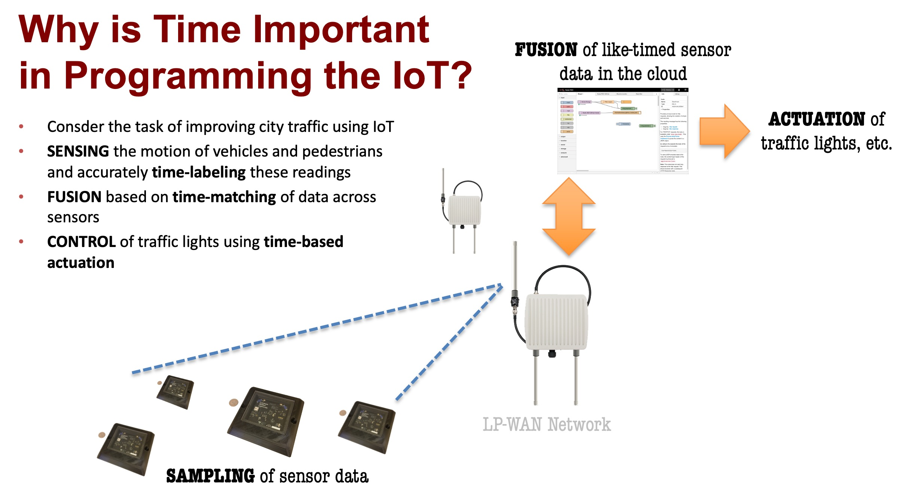

********
Overview
********

.. toctree::
   :caption: Overview
   :maxdepth: 2
   :hidden:

In the TickTalk (TT) project (`see our project page
<http://ccsg.ece.cmu.edu/wp/home/ticktalk/>`_ and `repository
<https://bitbucket.org/ccsg-res/ticktalkpython/src/master/>`_), our objective is
to make easier the problem of programming large arrays of loosely-timed systems,
such as the sensors in a smart city. In these systems:

*  Time matters
*  Parallelism is inherent
*  Hardware elements are heterogeneous
*  Power may be scarce

The programmer will be forced to deal with these issues, and improvements in one
domain may adversely impact another, like higher precison time synchronization
at the cost of power.

Our fundamental hypothesis is that *programming becomes easier when it is
possible to separate the questions of “Is this program logically correct?” from
“How do I optimally map this problem onto a large, loosely-timed array of
possibly heterogeneous computing elements?”*

Focusing on programming with time, we observe that it is fundamental to many
applications of distributed time-sensitive applications in Cyber Physical
Systems (CPS) and IoT.  We care about when physical quantities are sampled, we
care about being able to fuse multiple sensor readings that were taken at the
same time, and we care about being able to actuate things in the real world
(e.g., traffic signals) at specified times.  Historically, doing these things in
a programming language necessitated stepping outside of the language itself
because time was not represented as something foundational to the language.
With TickTalk, we think this limitation should be overcome, and in fact the
project name -- TickTalk -- derives from the idea that programming languages
should enable programmers to express (or *talk* about) notions of time
(expressed in ``ticks``).

**TTPython** is one such programming language. Built on the base of Python3,
TTPython seeks to add language constructs that enable programmers to express
timing concepts from the perspective of *what* to do with time rather than *how*
to do it. TTPython was conceived in January of 2021 as a language that can be
used within the TickTalk project to support research as well as a language that
can help to broaden the discussion about time-based programming for
loosely-timed systems.  The latter is an important point.  We are not seeking a
language that meets the requirements of hard real-time systems.  We are not
seeking a language that helps assure worst-case execution times are met.  There
is extensive work that has been done by others that covers these topics.

Instead, we enable non-specialist programmers to write programs for potentially
massive IoT sensor and actuator networks, in which statistical precision is
sufficient and in which time accuracy at a large scale (many sensors being
aggregated instead of depending on handling the data from just one) is more
important than precision at a small scale. TTPython enables programmers to write
distributed, time-sensitive applications as a singular program, in which the
program's temporal and mapping, *i.e.*, on which devices some piece of code
runs, can be specified in one place without requiring the programmer to
extensively describe interfaces and protocols among their distributed,
heterogeneous system components.

