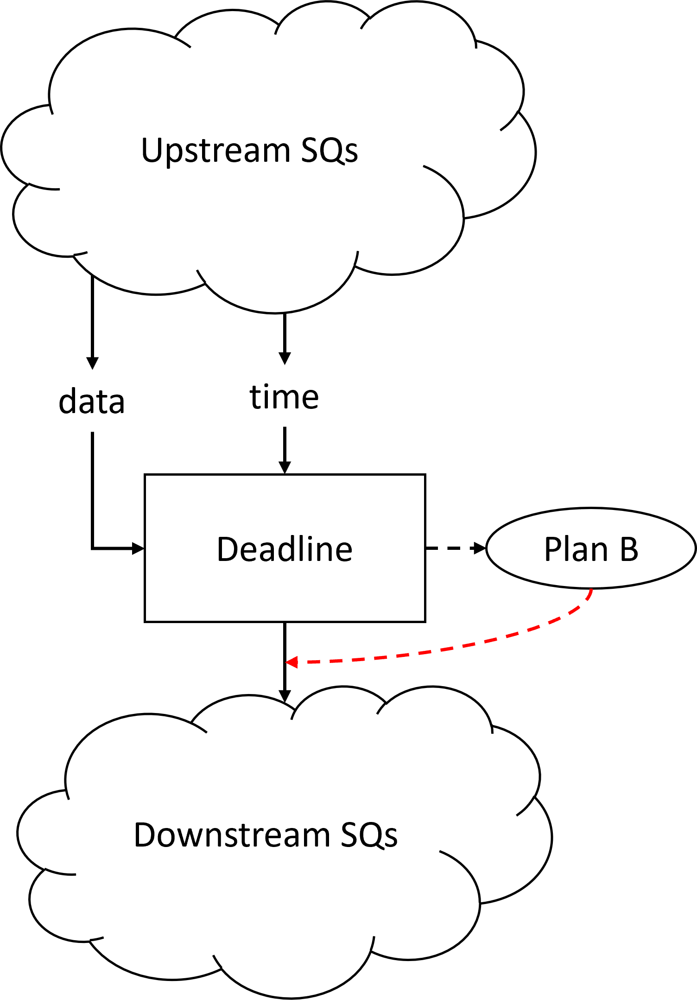

Tutorial - Deadlines and Plan B
===============================

.. _tutorial-deadlines:

We now have our entire pipeline created: two CAVs with a combined camera and
LIDAR data stream. Both of these feed into our global model at the RSU.
However, we'd like to have the global model updated in a timely fashion.
Say for example, this global model is used to update the future behavior of
these cars. If the global model doesn't respond in a timely fashion, the
cars could potentially crash into objects. So, if the global model doesn't
finish in a timely manner, we'd like to take some backup action, a *Plan B*
or so to speak.

We express this backup procedure directly following from failing to meet a
timing deadline with the construct ``TTFinishByOtherwise``. This deadline
construct functions similarly to an try/catch statement and takes two inputs:
a data value and a timestamp indicating the end of the deadline. One can
generate a timestamp by using ``READ_TTCLOCK`` and use arithmetic operands to
modify it.

``TTFinishByOtherwise`` generates a SQ that will wait for data values and
take action if the deadline timestamp that arrives is reached. If the data
value arrives before the deadline timestamp, execution will continue as normal
and ignore the *Plan B* path. Otherwise, the *Plan B* path will execute and
invalidate the current data value in the same time context, and the
programmer can specify how the program will return after it takes this path.
This pattern is repeated for each execution of the graph, so one can think
of this concept similar to the **continue** keyword in a for or while loop.

We have updated the code pertaining to the RSU to reflect this behavior.

.. code-block:: python

    @SQify
    def deadline_check():
        fusion_result = None
        return fusion_result

    @GRAPHify
    def streamify_test(trigger):
        ...
        sample_time = READ_TTCLOCK(cam_sample, TTClock=root_clock) + 1500000

        # Global fusion
        with TTQuery(components=["rsu"]):
            fusion_result_deadline = TTFinishByOtherwise(fusion_result, TTTimeDeadline=sample_time, TTPlanB=deadline_check(), TTWillContinue=True) #if deadline fails, it produces a separate value (similar to ternary operation: a = y if clock.now < t else None)
            fusion_result_deadline2 = TTFinishByOtherwise(fusion_result2, TTTimeDeadline=sample_time, TTPlanB=deadline_check(), TTWillContinue=True) #if deadline fails, it produces a separate value (similar to ternary operation: a = y if clock.now < t else None)
            global_fusion_result = global_fusion(fusion_result_deadline, fusion_result_deadline2)
            result = write_to_file(global_fusion_result)

``TTFinishByOtherwise`` requires meta-keywords ``TTTimeDeadline``,
``TTPlanB``, and ``TTWillContinue``. ``TTTimeDeadline`` is the deadline
timestamp required to call *Plan B*, and the backup procedure is
provided by the keyword ``TTPlanB``. ``TTPlanB`` requires a function
call as an input and will call that function with the arguments provided.

As backup handling is a control flow concept, the architecture requires
special handling in the runtime. Currently, ``TTFinishByOtherwise`` supports
two types of behaviors: replacing a 'late' value with a default value
provided by *Plan B* or to run a completely separate backup routine without
executing the rest of the data dependencies of that data variable. For
example, a backup routine on an autonomous vehicle that instructs the car to
apply the brakes may not want downstream SQs to execute after applying the
brakes, as they could tell the car to continue moving forward.
``TTWillContinue`` accepts a bool and indicates if the programmer intends
to execute the downstream SQs from the data value given if *Plan B* is
executed. If ``TTWillContinue`` is ``True``, then the default value passed
on will be the value returned by the function call specified with ``TTPlanB``.
This is visually represented in the image above by the red dotted line.
Otherwise, if ``TTWillContinue`` is ``False``, the compiler will not include
the red dotted line.

**Note:** In the current iteration of TTPython, our framework does not
support preemption while SQs run. Currently, SQs run on a single-threaded
environment, so deadline checking may not work when the checked data is being
generated on the same ensemble. This is not an issue in our example as
the data is being generated by the CAVs and being checked on the RSU.
We plan to address this in a future iteration of TTPython.

Let's look at how we can apply this construct to our Car Position Tracking
Application. ``sample_time`` is defined with respect to the timestamp taken
with respect to root clock and deadline set which is passed on to
``TTTimeDeadline``. ``TTPlanB`` actuates *Plan B* which is ``deadline_check``
if the data value does not arrive on time. The bool value ``True`` for
``TTWillContinue`` indicates that the graph will still execute
``global_fusion`` and ``write_to_file`` regardless if
*Plan B* occurred. The graph will use the output of ``deadline_check`` as the
value for ``fusion_result_deadline`` and ``fusion_result_deadline2``, which
would be ``None``.

Now check out Steps 10-12 to see how modifying the values generated by
``READ_TTCLOCK`` can change how the system adapts when the program makes
or fails to finish execution before the deadline time.
