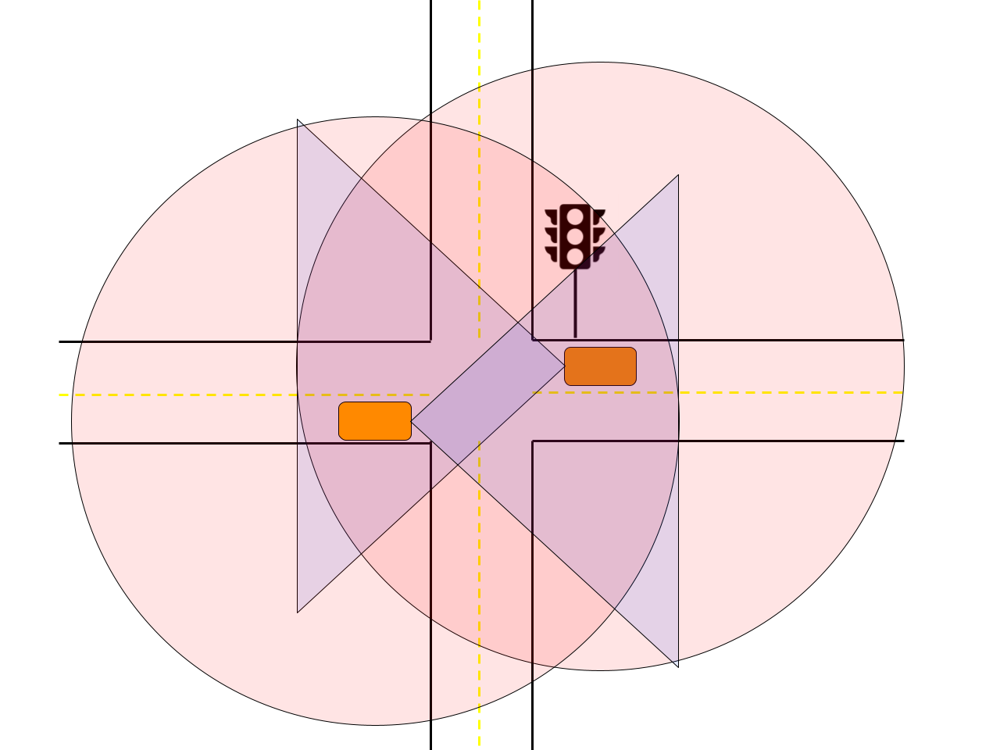

Tutorial - Car Position Tracking Application
==============================================================

.. _tutorial-intro:

**Car Position Tracking Application**

We motivate TTPython's flexibility in designing distributed
and time sensitive applications with an IoT application: a cooperative sensor fusion
problem where two Connected Autonomous Vehicels (CAVs) are tracking each other's
position on a road and creating a more accurate global fusion onboard a Road Side Unit
(RSU). These more accurate fusion results are shared to both vehicles in real time.
The purpose of this application is to show how TTPython handles streams of data and
how data streams can be fed to another node and combined using whatever
method the programmer desires. Two CAVs are present at a 4-way intersection
along with a traffic light that has an RSU stationed there that has a camera
attached. These two CAVS along with the camera have overlapping fields of
view of the main part of the intersection depending on
their current position, but outside of that area, the coverage area only
only extends to each CAV individually. With the CAVs moving this
coverage problem is actively changing in real time adding in extra complexity.

In this application, we wish to synchronize these two CAVs and the infrastructure
camera. Each CAV and the infrastructure camera are running their own computer vision
pipeline, with the CAVs having an additional LIDAR pipeline that is processed
onboard their hardware (Jetson Nano) individually.
The output of the cameras and their pipelines are then streamed to a central node called
the Road Side Unit or RSU. This RSU takes in the two CAV streams and camera stream
and fuses them into a single representation of the traffic light area using a Kalman filter.

This example illustrates a few constructs from TickTalk. The first construct is the idea
that a single function can be instantiated in multiple places. In this
example, we create simulated instances of both CAVs from the same function and recognition
classes. We spawn one
camera stream and a recognition class as well as a LIDAR stream and recognition class on
the same device. TTPython handles creating, loading code, and identifying the individual
devices and streams. The two streams of camera and LIDAR are timed using the same interval
(8 Hz) and streamed to a single fusion node that will run onboard the CAV and outputs a
locally fused stream. Both CAVs are created using the same code, so the process of
creating them is identical and is all handled by TTPython. Interestingly the exact same code is
used for the traffic mounted camera as well. The same camera recognition code and local
fusion is used; the LIDAR is simply removed as there is no LIDAR sensor involved. This
further shows the usefulness of TTPython - three devices spawned using nearly identical
code. Post local fusion, the CAVs and traffic camera share
their locally fused streams with the Road Side Unit where the global sensor fusion is done.
TTPython handles the association of the data points from these streams, in fact handling
five individual streams in total which are pared down to three streams for the global
fusion step. The global sensor fusion node then simply receives data points that are
already matched in time from how we set the interval. Sensor fusion is performed via a Kalman
filter using the timestamps that TTPython already stamped the camera streams with when the camera
frame was taken. This allows for precise updation of the Kalman filter using the exact timestamps
that are already associated with the same clock. The end output is a series of points that we use
to show detected vehicle routes in a graph.

What happens if despite all of this precise timing something still goes wrong, like a
data link is slow or a sensor goes offline? TTPython has a solution for this as well.
Using a construct that we call PlanB, the TTPython programmer can plan for contingencies
and unpredictable faults by telling the program what to do in the event a streaming
event is missed - such as the case where one CAV does not make the deadline to send
its locally fused data to the RSU. In this case the programmer can specify with
Plan B that the global fusion should take place anyways using all available data
when the global fusion deadline arrives to the Plan B mechanism - thus allowing
graceful degradation or even an emergency braking maneuver to be enforced.

This example shows the ability of TTPython to synchronize multiple streaming sources
as well as provide the precise timestamps that are associated with the same clock
such that sensor fusion can be done in a precise way. It also shows how TTPython
can handle deadline and synchronization misses for graceful degradation or even
emergency braking maneuvers through the PlanB construct.
